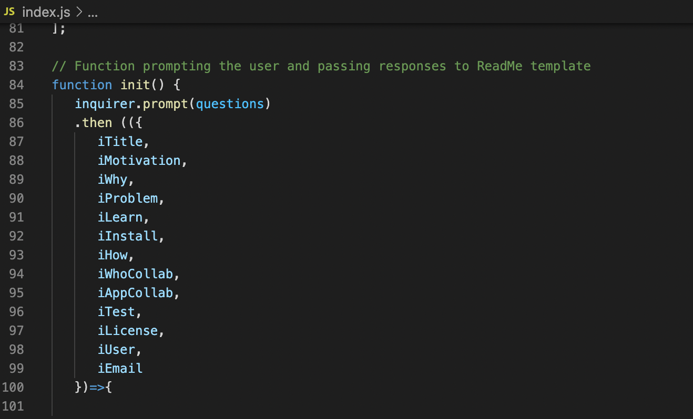
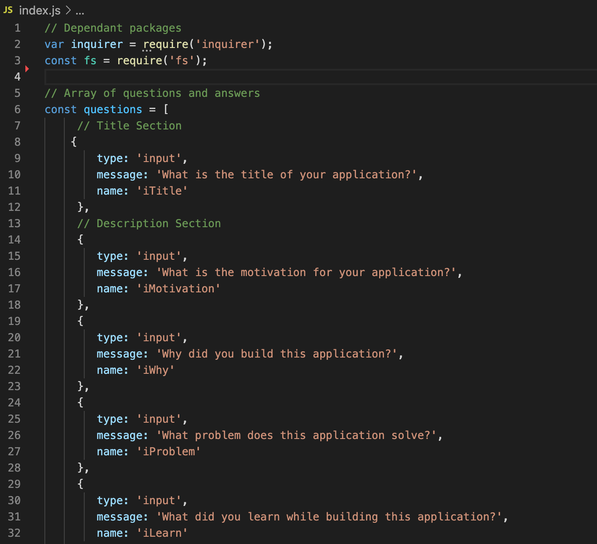
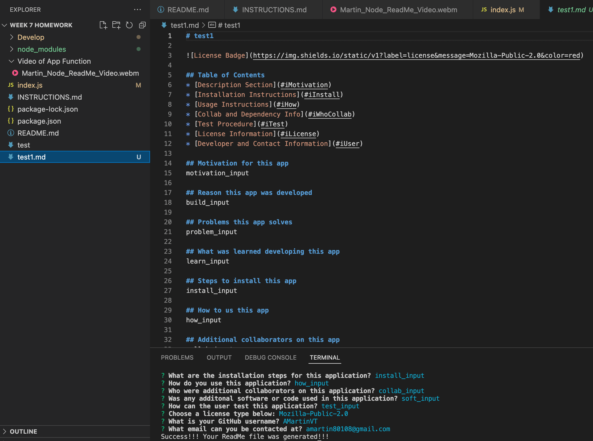
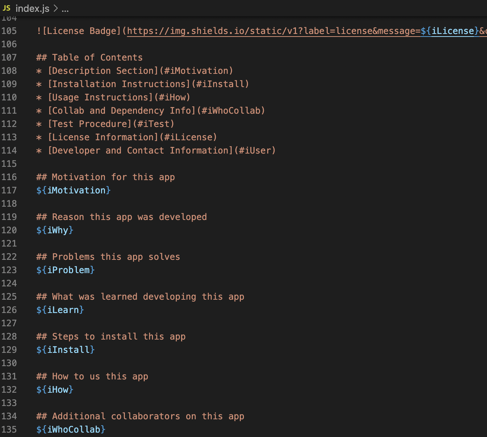
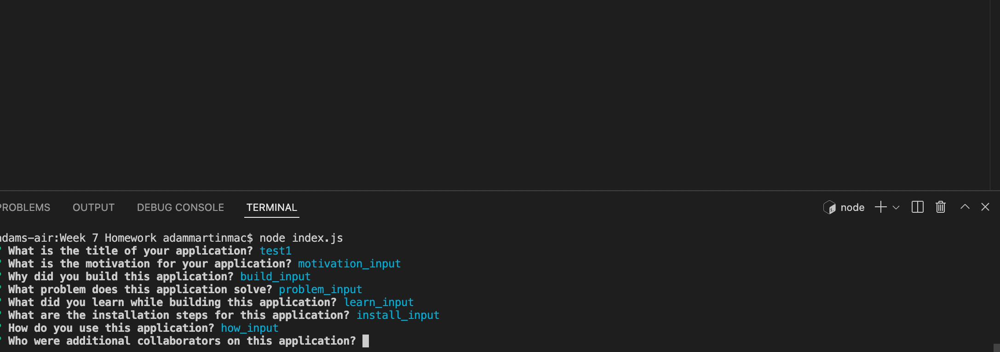
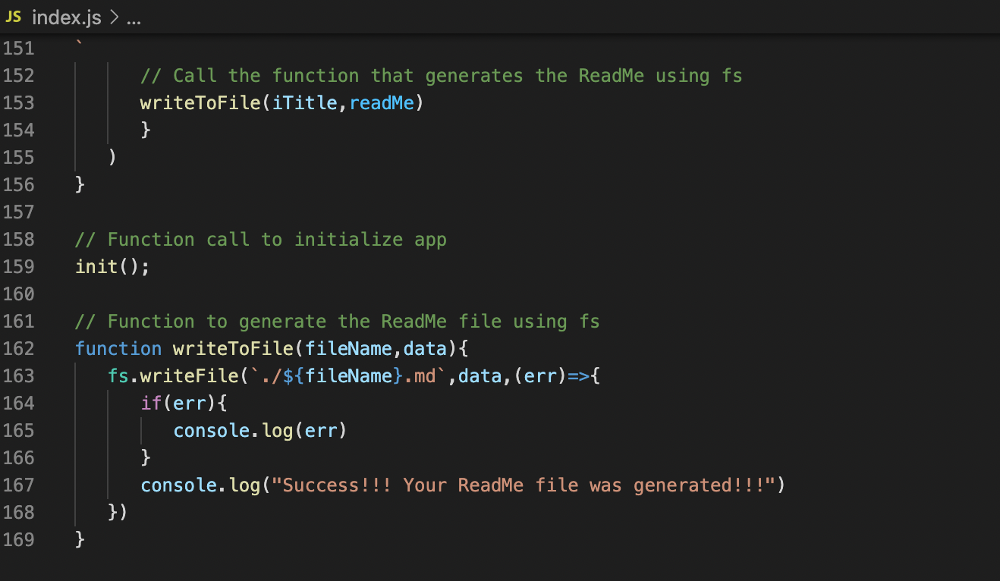

### Header
Title: ReadMe Generator

Author: Adam Martin

Due Date: 7/11/22 (Week 7)

### About
This application takes user-input via the command-line and creates a README.md file to specific criteria.

### Dependencies
- NPM
- Inquirer
- fs

### Link to Repo

### Link to Video

### Screenshots

